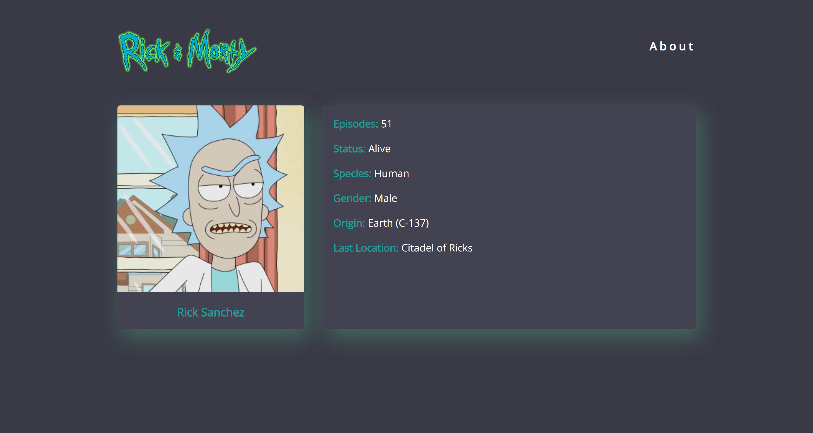

# Rick & Morty API SPA with JS Vanilla

This is a Single Page Applications with routes and components, created with JavaScript vanilla requesting data from the rick and morty API and display it on the screen, also at clicking on a character you navigate through a detail view of the character.

## Table of contents

- [Overview](#overview)
  - [The challenge](#the-challenge)
  - [Screenshot](#screenshot)
  - [Links](#links)
- [My process](#my-process)
  - [Built with](#built-with)
  - [What I learned](#what-i-learned)
  - [Useful resources](#useful-resources)
- [Author](#author)

## Overview

### The challenge

Users should be able to:

- See all characters from the API on the homepage
- See a detail page of each character

### Screenshot

### Links

- Solution URL: [Solution URL here](https://github.com/ncondes/rick-and-morty-spa-js-vanilla)
- Live Site URL: [Live site URL here](https://ncondes.github.io/rick-and-morty-spa-js-vanilla/dist/)

## My process

### Built with

- Semantic HTML5 markup
- CSS custom properties
- Flexbox
- CSS Grid
- Mobile-first workflow
- [Webpack](https://webpack.js.org/) - Webpack
- JavaScript

### What I learned and put into practice

- Set up Webpack & Babel
- Configure routes on vanilla JS
- Built helpers JS functions using ES6
- Require data from an API

### Useful resources

- [Developer Mozilla](https://developer.mozilla.org/en-US/) - Documentation for JavaScript.

## Author

- Website - [Nicolas Conde Salazar](https://www.ncondes.com)
- Linkedin - [Nicolas Conde Salazar](https://www.linkedin.com/in/ncondes/)

